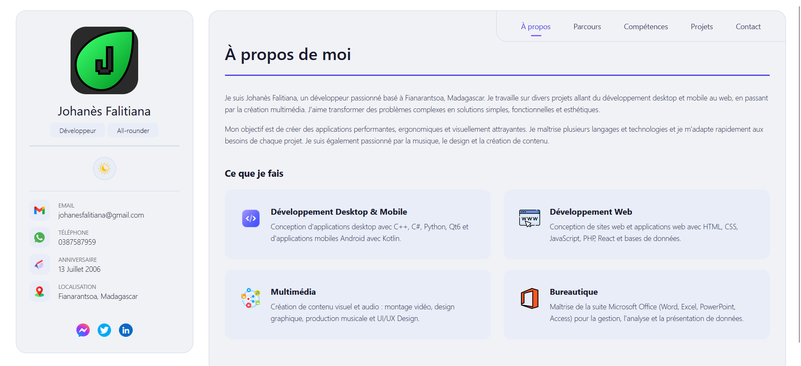
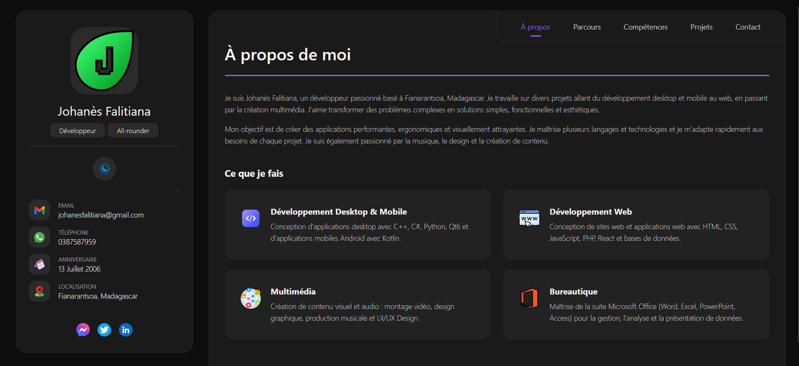
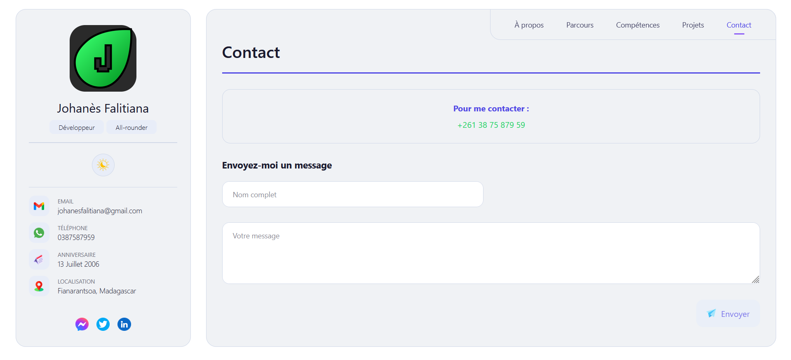
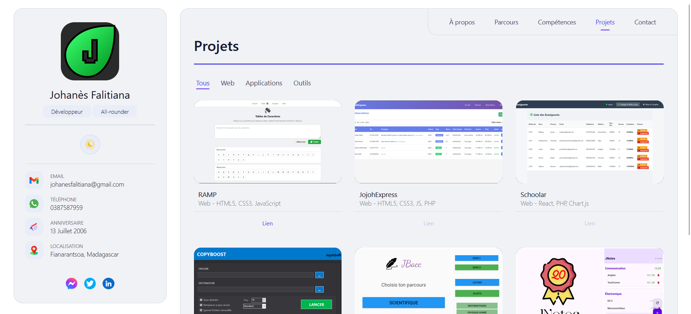
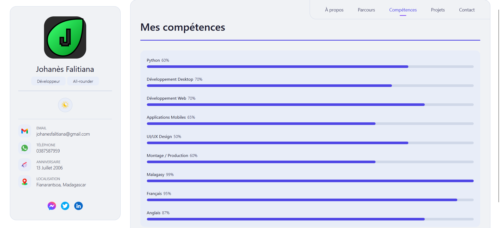

# Portfolio de Johanès Falitiana

Colorons le monde au-delà des lignes 🎨

## 🎗️ À propos

Je suis Johanès Falitiana, un développeur polyvalent spécialisé dans le développement desktop, mobile et web. Ce portfolio présente mes compétences, mes projets et mon parcours.

## 🛠️ Technologies utilisées

- **HTML5**
- **CSS3**
- **JavaScript**
- 
---

## 📸 Captures d'écran

### 🏠 Page d'accueil (Mode Clair)

### 🌙 Page d'accueil (Mode Sombre)

### 📞 Page de contact

### 📂 Projets

### 🛠️ Compétences

---

## 📂 Structure du projet

Johanes/

├── index.html # Page principale

├── johanes.css # Styles

├── johanes.js # Fonctionnalités JavaScript

    └── images/ # Images et icônes
├── captures/ # Images

## 📊 Compétences

| Catégorie       | Compétences                                             |
| --------------- | ------------------------------------------------------- |
| **Langages**    | Python, HTML5, CSS3, JavaScript, PHP, Kotlin, C++, C#   |
| **Frameworks**  | React, Qt6, .NET 8.0                                    |
| **Design**      | UI/UX Design, Figma, Montage vidéo, Production musicale |
| **Langues**     | Malagasy (100%), Français (95%), Anglais (85%)          |
| **Bureautique** | Microsoft Office (Word, Excel, PowerPoint, Access)      |

## 📱 Projets mis en avant

| Projet           | Description           | Technologies            |
| ---------------- | --------------------- | ----------------------- |
| **RAMP**         | Application web       | HTML5, CSS3, JavaScript |
| **JojohExpress** | Site web dynamique    | HTML5, CSS3, JS, PHP    |
| **Schoolar**     | Application éducative | React, PHP, Chart.js    |
| **CopyBoost**    | Outil de copie        | C#, .NET 8.0, Robocopy  |
| **JBacc**        | Application mobile    | Kotlin, Android         |
| **JNotes**       | Application mobile    | Kotlin, Android         |

## 📧 Contact

- **Email** : [falitianajohanes@gmail.com](mailto:falitianajohanes@gmail.com)
- **WhatsApp** : [+261 38 75 879 59](https://wa.me/261387587959)

## 📄 Licence

Ce projet est open source et disponible sous licence MIT.

© 2026 Johanès Falitiana
