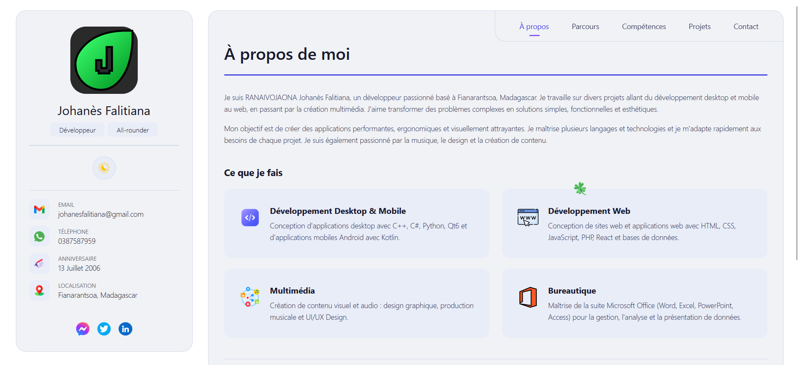
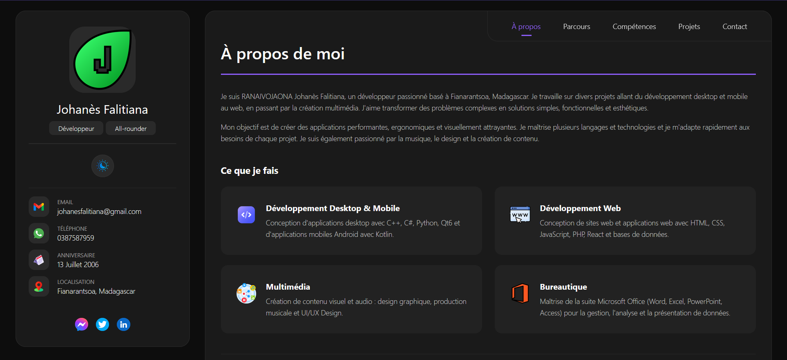
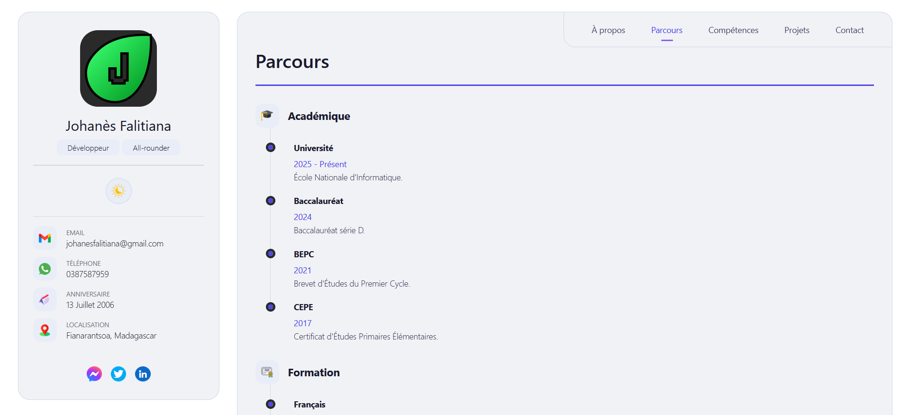
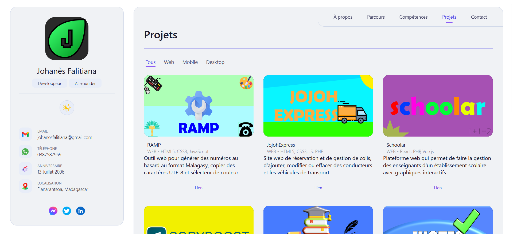
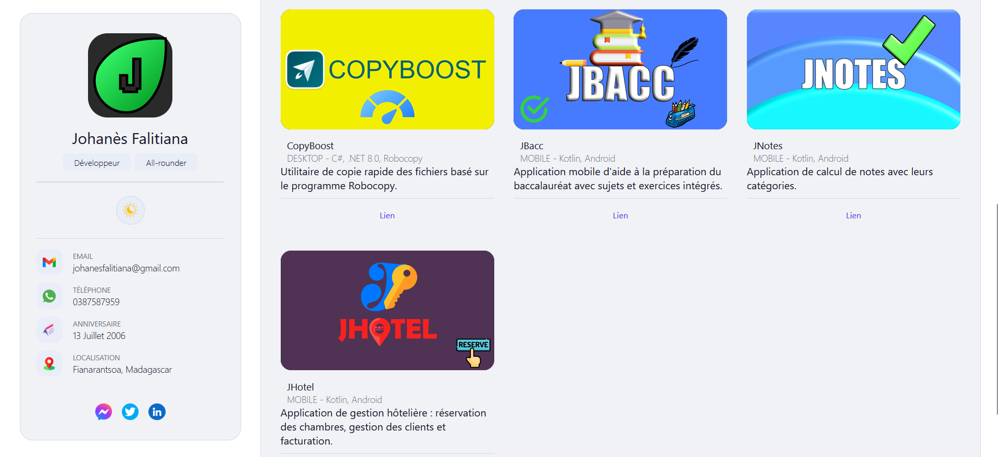
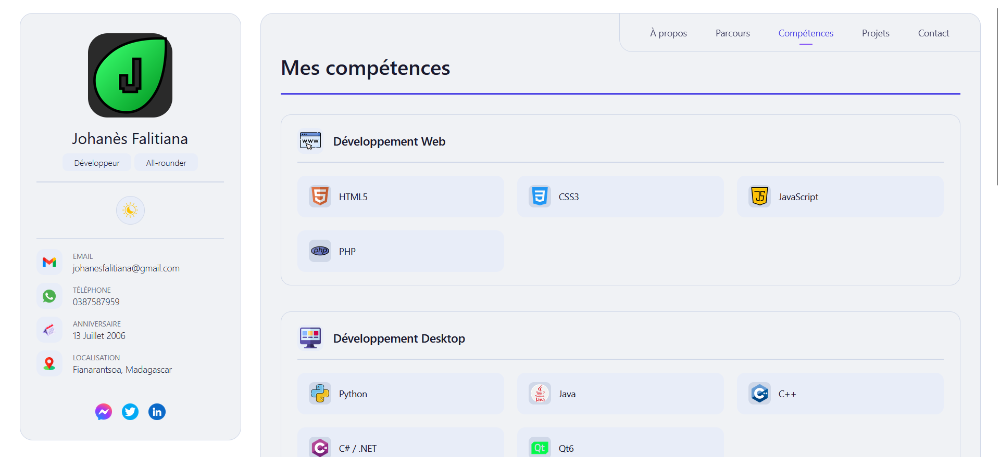
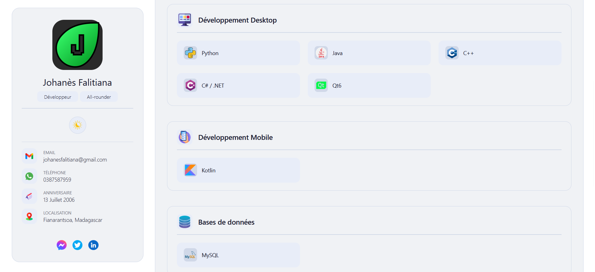
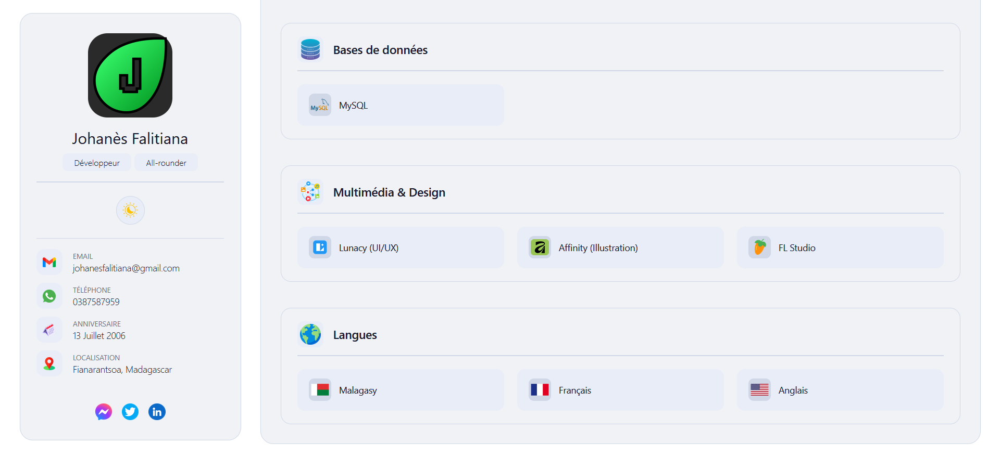
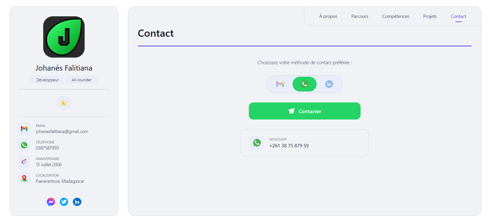

# 🍀Johanès Falitiana

🎨Colorons le monde au-delà des lignes

## 🎗️ À propos

Je suis Johanès Falitiana, un développeur polyvalent spécialisé dans le développement desktop, mobile et web.
Ce portfolio présente mes compétences, mes projets et mon parcours.

## 📷 Captures d'écran

### Page d'accueil (Mode Clair)

### Page d'accueil (Mode Sombre)

### 🔖 Parcours

### 🏷️ Projets

### ♠️ Compétences

### 📞 Page de contact

---

## 🌳 Arborescence

Johanes/

├── index.html # Page principale

├── johanes.css # Styles

├── johanes.js # Fonctionnalités JavaScript
└── images/\* # Images et icônes

├── captures/ # Images des captures d'écrans

## 🎖️ Compétences

| Catégorie       | Compétences                                           |
| --------------- | ----------------------------------------------------- |
| **Langages**    | Python, HTML5, CSS3, JavaScript, PHP, Kotlin, C++, C# |
| **Frameworks**  | React, Qt6, .NET 8.0                                  |
| **Graphiques**  | Lunacy UI/UX, Affinity Illustrator, FL Studio         |
| **Langues**     | Malagasy, Français ,Anglais                           |
| **Bureautique** | Suites Office (Word, Excel, PowerPoint, Access)       |

## 📱 Projets realisé

| Projet           | Platformes         | Technologies utlisé     |
| ---------------- | ------------------ | ----------------------- |
| **RAMP**         | Web                | HTML5, CSS3, JavaScript |
| **JojohExpress** | Web                | HTML5, CSS3, JS, PHP    |
| **Schoolar**     | Web                | React, PHP, Chart.js    |
| **JojohExpress** | Web                | C#, .NET 8.0, Robocopy  |
| **CopyBoost**    | Desktop/Windows    | C#, .NET 8.0, Robocopy  |
| **JBacc**        | Application mobile | Kotlin, Android         |
| **JNotes**       | Application mobile | Kotlin, Android         |
| **JHotel**       | Application mobile | Kotlin, Android         |

## 📨 Contact

- **WhatsApp** : [+261 38 75 879 59](https://wa.me/261387587959)

## 📜 Licence

Ce projet est open source et disponible sous licence MIT.

© 2026 Johanès Falitiana
